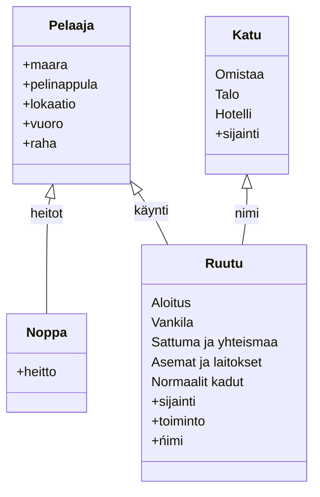

## Monopoli laajennettu sovelluslogiikka

```mermaid
classDiagram
Pelaaja<|--Noppa: heitot
Pelaaja<|--Ruutu: käynti
Katu<|--Ruutu: nimi
Ruutu : Aloitus
Ruutu : Vankila
Ruutu : Sattuma ja yhteismaa
Ruutu : Asemat ja laitokset
Ruutu : Normaalit kadut
Katu : Omistaa
Katu : Talo
Katu : Hotelli
	class Pelaaja{
        +maara
        +pelinappula
        +lokaatio
        +vuoro
        +raha
	}
	class Noppa{
        +heitto
    }
    class Ruutu{
        +sijainti
        +toiminto
        +ńimi
    }
    class Katu{
        +sijainti
    }
```