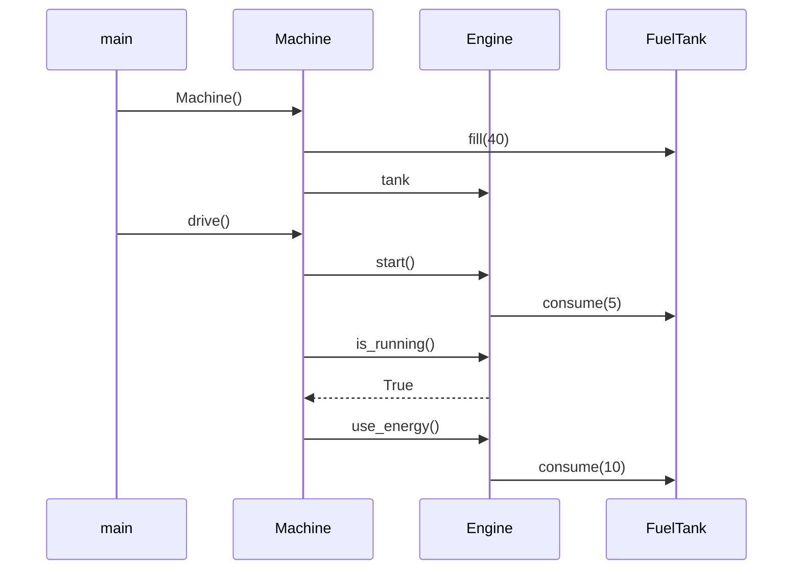

## Koneen sekvenssikaavio

```mermaid
sequenceDiagram
    participant main
    participant Machine
    participant Engine
    participant FuelTank
    main->>Machine: Machine()
    Machine->>FuelTank: fill(40)
    Machine->>Engine: tank
    main->>Machine: drive()
    Machine->>Engine: start()
    Engine->>FuelTank: consume(5)
    Machine->>Engine: is_running()
    Engine-->>Machine: True
    Machine->>Engine: use_energy()
    Engine->>FuelTank: consume(10)

```